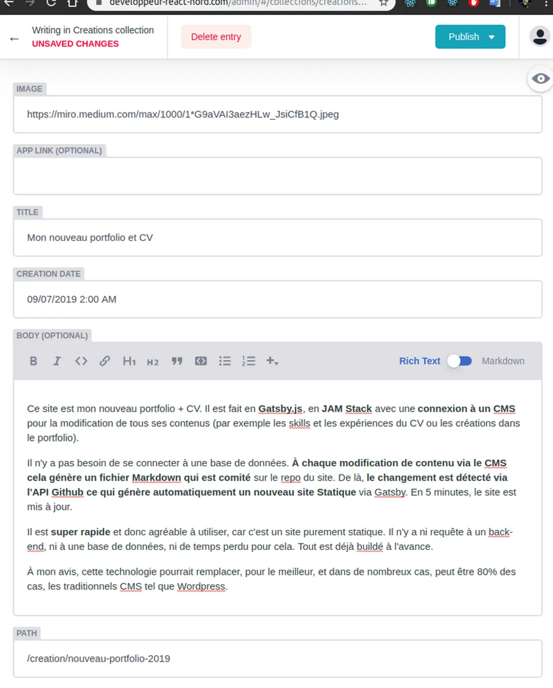

Ce site est mon nouveau portfolio + CV. Il est fait en **Gatsby.js**, en **JAM Stack** avec une **connexion à un CMS** pour la modification de tous ses contenus (par exemple les skills et les expériences du CV ou les créations dans le portfolio).

Il n'y a pas besoin de se connecter à une base de données. **À chaque modification de contenu via le CMS cela génère un fichier Markdown qui est comité** sur le repo du site. De là, **le changement est détecté via l'API Github ce qui génère automatiquement un nouveau site Statique** via Gatsby. En 5 minutes, le site est mis à jour.

Il est **super rapide** et donc agréable à utiliser, car c'est un site purement statique. Il n'y a ni requête à un back-end, ni à une base de données, ni de temps perdu pour cela. Tout est déjà buildé à l'avance.

À mon avis, cette technologie pourrait remplacer, pour le meilleur, et dans de nombreux cas, peut être 80% des cas, les traditionnels CMS tel que Wordpress.

Comme vous pouvez le voir, il est aussi possible d'upload et d'afficher une image via le CMS ou encore de travailler à plusieurs en invitant par e-mail des collaborateurs.
