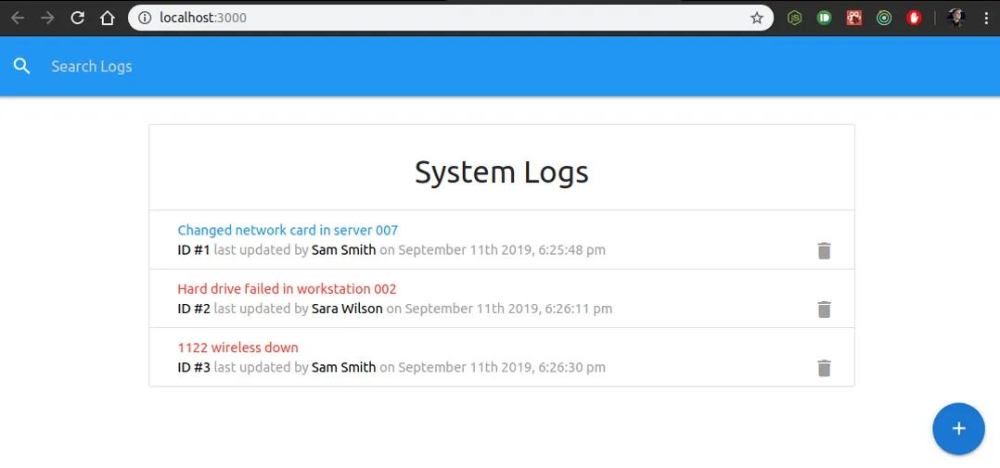
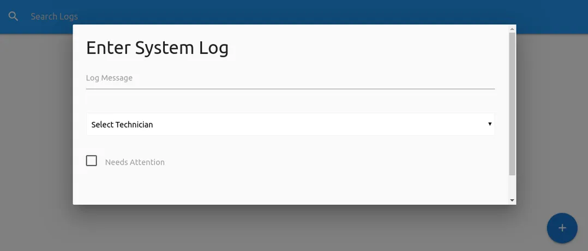

<!--  -->

<!-- 

 -->

Création d'une application qui génère des logs suite aux interventions de techniciens.

<!-- good first image bellow -->

API Rest simulée par le paquet json-server.

Création de fenêtres modales via le framework CSS Materialize.

Création d'une search bar pour filtrer la liste des logs.

Utilisation de React, hooks et surtout Redux avec plusieurs actions et reducers.
